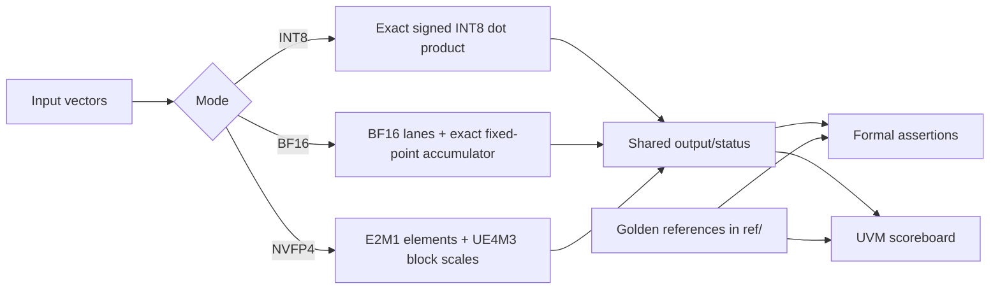

# Precision Dot Product DV Lab

**Formal and UVM verification for an INT8, BF16, and NVFP4 vector dot-product core**

**Author:** Sasha Katne

This repository verifies an 8-lane mixed-precision dot-product unit using formal
property verification, directed simulation, and a UVM constrained-random
environment. The design uses exact accumulation internally and shares the same
SystemVerilog golden references between formal assertions and simulation
scoreboards.

| Area | Summary |
|------|---------|
| Numeric tiers | INT8, BF16, NVFP4 block-scaled FP4 |
| RTL language | SystemVerilog |
| Verification | SVA, VC Formal FPV, Questa directed simulation, UVM |
| Final status | Complete: 22 formal jobs, 7 UVM tests, 100% reachable merged coverage |
| Sign-off report | [`doc/Precision_Dot_Product_DV_Lab_Final_Report.pdf`](doc/Precision_Dot_Product_DV_Lab_Final_Report.pdf) |

## Start Here

| Goal | Open |
|------|------|
| Read the final PDF report | [`doc/Precision_Dot_Product_DV_Lab_Final_Report.pdf`](doc/Precision_Dot_Product_DV_Lab_Final_Report.pdf) |
| Understand the full result | [`doc/FinalReport_M5.md`](doc/FinalReport_M5.md) |
| Inspect the top RTL | [`rtl/dotprod_top.sv`](rtl/dotprod_top.sv) |
| Inspect the pipelined wrapper | [`rtl/dotprod_seq.sv`](rtl/dotprod_seq.sv) |
| Read the golden models | [`ref/`](ref) |
| Browse formal properties | [`formal/RTL/`](formal/RTL) |
| Browse UVM components | [`verif/uvm/`](verif/uvm) |
| Run directed simulation | [`sim/run.do`](sim/run.do) |
| Run the UVM regression | [`verif/sim/run.do`](verif/sim/run.do) |

## What Was Verified

The project closes three arithmetic tiers plus a streaming wrapper:



| Tier | Main proof strategy | Simulation strategy | Result |
|------|---------------------|---------------------|--------|
| INT8 | Exhaustive top equivalence against `dotprod_ref` | Directed smoke plus UVM random/corner tests | Proven |
| Sequential wrapper | Protocol SVA for ready/valid and backpressure | UVM backpressure tests | Proven |
| BF16 | Assume-guarantee decomposition across lane, align, round, and top; proven over the full BF16 input space (out-of-window operands flagged invalid) | BF16 random/corner UVM tests | Proven |
| NVFP4 | Pure-DUT-net assume-guarantee proof plus standalone scale/lane/round proofs | NVFP4 random/corner UVM tests | Proven |

## Verification Dashboard

| Metric | Final result |
|--------|-----------------|
| Formal jobs | 22 total: 11 clean, 11 bug-injected |
| Clean formal runs | All target assertions proven (BF16 proven over the full input space) |
| Bug-injected runs | Each mutation falsifies at least one intended assertion; each fault has its own dedicated define |
| UVM tests | 7 tests, zero mismatches, zero leftovers |
| Coverage | 100.00% reachable merged coverage |
| Waivers | One structurally unreachable branch leg, documented in [`verif/sim/coverage_waivers.do`](verif/sim/coverage_waivers.do) |

Two cover goals are intentionally unreachable:

- INT8 saturation cannot occur for a single 8-lane dot product because the exact
  maximum sum fits well below the 32-bit output range.
- The maximum NVFP4 scale significand condition cannot occur because the largest
  E2M1 significand product is below the covered threshold.

## Repository Map

<details open>
<summary><strong>Core design and reference model</strong></summary>

| Path | What it contains |
|------|------------------|
| [`rtl/`](rtl) | Synthesizable datapath, top, sequential wrapper, and format-specific stages |
| [`ref/`](ref) | Shared SystemVerilog golden reference functions |
| [`doc/`](doc) | Design specs, verification plans, reports, and architecture diagrams |

</details>

<details>
<summary><strong>Formal verification</strong></summary>

| Path | What it contains |
|------|------------------|
| [`formal/RTL/`](formal/RTL) | SVA modules, bind files, and formal filelists |
| [`formal/run/`](formal/run) | VC Formal Tcl scripts for clean and bug-injected jobs |

The formal suite uses small standalone proofs where possible, then composes
larger top-level guarantees by transitivity. This keeps nonlinear golden calls
out of the hardest equivalence miters.

</details>

<details>
<summary><strong>Simulation and UVM</strong></summary>

| Path | What it contains |
|------|------------------|
| [`sim/tb/`](sim/tb) | Directed SystemVerilog testbenches |
| [`sim/run.do`](sim/run.do) | Directed simulation run script |
| [`verif/tb/`](verif/tb) | UVM top-level testbench |
| [`verif/uvm/`](verif/uvm) | UVM agents, sequences, scoreboard, coverage, and tests |
| [`verif/sim/run.do`](verif/sim/run.do) | UVM regression run script |

Raw logs, transcripts, UCDBs, and coverage reports are generated artifacts and
are intentionally ignored.

</details>

## Runbook

These commands assume compatible VC Formal and Questa installations are already
available in the shell environment.

<details open>
<summary><strong>Directed simulation</strong></summary>

```bash
cd sim
vsim -c -do run.do
```

Expected result: directed testbenches complete with no scoreboard mismatches.

</details>

<details>
<summary><strong>UVM regression</strong></summary>

```bash
cd verif/sim
vsim -c -do run.do
```

Expected result: all enabled UVM tests complete with `mismatched=0`,
`leftover=0`, `UVM_ERROR=0`, and `UVM_FATAL=0`.

</details>

<details>
<summary><strong>INT8 formal proofs</strong></summary>

```bash
cd formal/run
vcf -batch -f fpv_run_top.tcl
vcf -batch -f fpv_run_top_buginjected.tcl
vcf -batch -f fpv_run_seq.tcl
vcf -batch -f fpv_run_seq_buginjected.tcl
```

Expected result: clean proofs prove; bug-injected variants falsify their target
properties.

</details>

<details>
<summary><strong>BF16 formal proofs</strong></summary>

```bash
cd formal/run
vcf -batch -f fpv_run_lane_bf16.tcl
vcf -batch -f fpv_run_lane_bf16_buginjected.tcl
vcf -batch -f fpv_run_lane_bf16_oor_buginjected.tcl
vcf -batch -f fpv_run_align_bf16.tcl
vcf -batch -f fpv_run_round_bf16.tcl
vcf -batch -f fpv_run_special_bf16.tcl
vcf -batch -f fpv_run_bf16_top.tcl
vcf -batch -f fpv_run_bf16_top_buginjected.tcl
```

Expected result: lane, align, round, special-case, and top assume-guarantee
proofs converge over the full BF16 input space; the lane FTZ mutation, the
out-of-range mutation, and the injected top mutation each falsify.

</details>

<details>
<summary><strong>NVFP4 formal proofs</strong></summary>

```bash
cd formal/run
vcf -batch -f fpv_run_lane_nvfp4.tcl
vcf -batch -f fpv_run_lane_nvfp4_buginjected.tcl
vcf -batch -f fpv_run_scale_nvfp4.tcl
vcf -batch -f fpv_run_scale_nvfp4_buginjected.tcl
vcf -batch -f fpv_run_round_nvfp4.tcl
vcf -batch -f fpv_run_round_nvfp4_buginjected.tcl
vcf -batch -f fpv_run_nvfp4_top.tcl
vcf -batch -f fpv_run_nvfp4_top_buginjected.tcl
```

Expected result: clean lane, scale, round, and top proofs converge; each
bug-injected variant falsifies the relevant property.

</details>

## Milestone Guide

<details>
<summary><strong>M1: INT8 combinational core</strong></summary>

- Design: [`doc/DesignSpec.md`](doc/DesignSpec.md)
- Plan: [`doc/VerificationPlan.md`](doc/VerificationPlan.md)
- Report: [`doc/FinalReport.md`](doc/FinalReport.md)

M1 proves the exact INT8 combinational dot product directly against the shared
golden model.

</details>

<details>
<summary><strong>M2: Sequential wrapper and UVM environment</strong></summary>

- Design: [`doc/DesignSpec_M2.md`](doc/DesignSpec_M2.md)
- Plan: [`doc/VerificationPlan_M2.md`](doc/VerificationPlan_M2.md)
- Report: [`doc/FinalReport_M2.md`](doc/FinalReport_M2.md)

M2 wraps the combinational core in a ready/valid pipeline and verifies protocol
behavior with SVA plus a reusable UVM environment.

</details>

<details>
<summary><strong>M3: BF16 tier</strong></summary>

- Design: [`doc/DesignSpec_M3.md`](doc/DesignSpec_M3.md)
- Plan: [`doc/VerificationPlan_M3.md`](doc/VerificationPlan_M3.md)
- Report: [`doc/FinalReport_M3.md`](doc/FinalReport_M3.md)

M3 adds BF16 special-value handling, exact accumulation in a bounded exponent
window [119,134], and a single final round to FP32. Operands outside that window
are detected and flagged as an invalid operation (canonical QNaN), so the tier is
formally proven over the full BF16 input space rather than only in-window.

</details>

<details>
<summary><strong>M4: NVFP4 tier</strong></summary>

- Design: [`doc/DesignSpec_M4.md`](doc/DesignSpec_M4.md)
- Plan: [`doc/VerificationPlan_M4.md`](doc/VerificationPlan_M4.md)
- Report: [`doc/FinalReport_M4.md`](doc/FinalReport_M4.md)

M4 adds the NVFP4 block-scaled datapath and verifies the inner product, scale
multiply, and top composition.

</details>

<details>
<summary><strong>M5: Unified sign-off</strong></summary>

- Report: [`doc/FinalReport_M5.md`](doc/FinalReport_M5.md)
- Waiver: [`verif/sim/coverage_waivers.do`](verif/sim/coverage_waivers.do)

M5 completes the NVFP4 final-round proof, reruns the full regression, and closes
reachable merged coverage to 100.00%.

</details>

## Artifact Policy

Generated EDA outputs are intentionally not tracked:

- Formal run databases and logs
- Simulation transcripts
- Waveforms
- UCDB coverage databases and generated coverage reports
- Local tool scratch directories

The checked-in source tree is intended to be reproducible from RTL, reference
models, formal scripts, simulation scripts, UVM source, and summarized reports.
